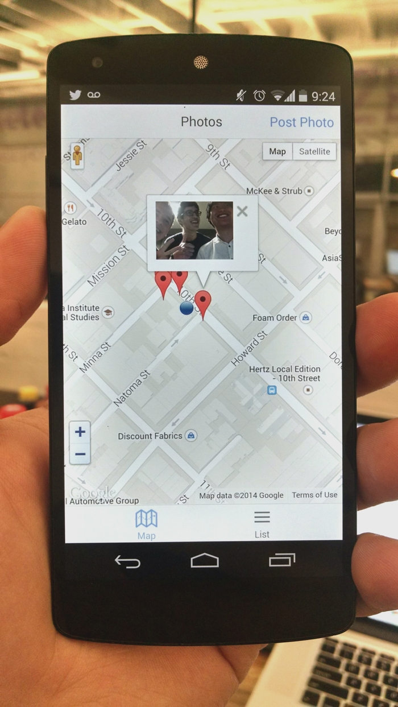

meteor-poi
==========

Meteor-POI is an app to curate points of interest.

It is maintained and tested to evaluate the relevance and performance of Meteor to develop mobile apps. But it also runs on desktop.

This repository was forked from one of the examples of the [mobile-packages](https://github.com/meteor/mobile-packages) repository. This was originally the app that was first used to demonstrate Meteor Cordova functionality at the Meteor Devshop in August 2014. It uses the Camera, Geolocation, and reload-on-resume packages, in addition to local packages for [Ionic Framework CSS](http://ionicframework.com/) and a simple implementation of the [Google Maps Javascript API](https://developers.google.com/maps/documentation/javascript/).

It runs on Meteor 0.9.2 and above.

